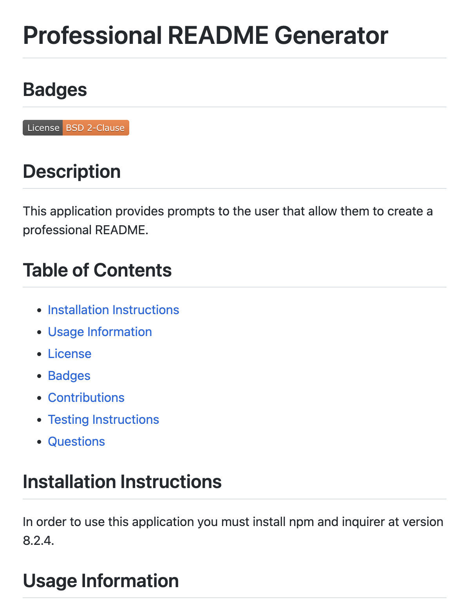

# Professional README Generator

## Description
This application prompts the user for information that will allow them to create a professional README. This allows creators to create a README file with the minimum details that will show viewers the necessary information about the application.

[Watch me create a professional README](https://drive.google.com/file/d/1tqjBxeaV-lcyae3Tb7P7RdJMzbxG2eDv/view)

[Professional README Generator](https://github.com/kthames/READMEGenerator)

## Authors

Katherine Thames - k.thames@me.com
